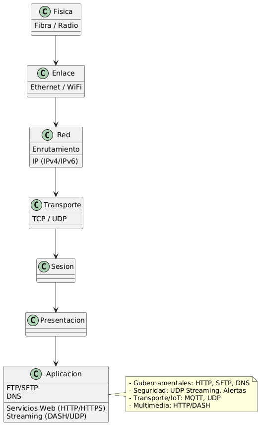
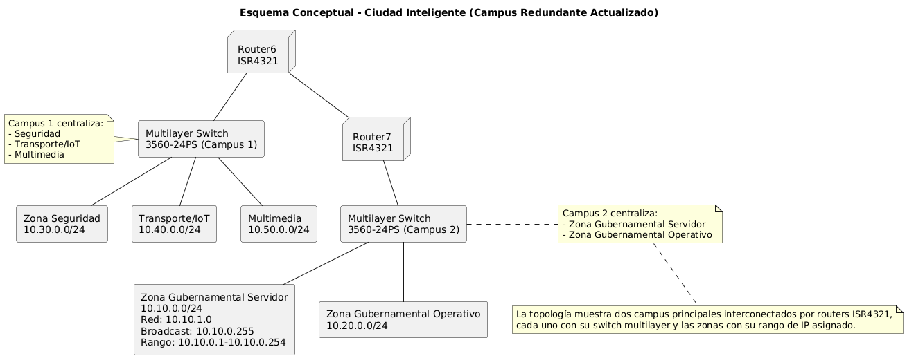

# CFI
# Solución para la Arquitectura de Comunicaciones de una Ciudad Inteligente

---

## **Paso 1: Diseño y Modelado de la Arquitectura de Comunicación**

### **A) Modelos OSI y TCP/IP y su integración**

- **Modelo OSI (7 capas):**  
  1. Física  
  2. Enlace de datos  
  3. Red  
  4. Transporte  
  5. Sesión  
  6. Presentación  
  7. Aplicación

- **Modelo TCP/IP (4 capas):**  
  1. Acceso a red (física + enlace)  
  2. Internet (red)  
  3. Transporte  
  4. Aplicación (sesión, presentación y aplicación)

  Muestra cómo los servicios de la ciudad inteligente se ubican en el modelo OSI y TCP/IP, justificando la integración de ambos modelos.

  

- **Integración para los servicios:**  
  - **Servicios gubernamentales:** Se necesita alta fiabilidad → Uso de TCP, VPN, cifrado TLS.
  - **Seguridad y emergencias:** Baja latencia, tolerancia a fallos → UDP para streaming, rutas redundantes, firewalls.
  - **Transporte e IoT:** Tramas pequeñas, baja latencia → Protocolos ligeros (MQTT, UDP), segmentación dedicada.
  - **Servicios multimedia:** Alto ancho de banda → HTTP/HTTPS para portales, UDP/DASH para video.

---

### **B) Diseño Lógico y Segmentación**

**Diagrama conceptual:**  
Este diagrama muestra cómo se segmenta la ciudad en zonas para cada servicio crítico y cómo se interconectan a través de un backbone central. Cada segmento tiene dispositivos específicos y enlaces redundantes para alta disponibilidad.


- **Segmentos:**  
  - Zona Gubernamental
  - Zona Seguridad Pública
  - Zona Transporte e IoT
  - Zona Servicios Multimedia

- **Dispositivos por segmento:**  
  - **Routers**: Interconexión y segmentación L3.
  - **Switches**: Conexión interna L2.
  - **Access Points**: Cobertura inalámbrica.
  - **Servidores**: DNS, FTP/SFTP, HTTP(S), multimedia.
  - **Firewalls**: Seguridad perimetral.
  - **Cámaras IP, sensores IoT**: Finales de red.

- **Interconexión:**  
  - Core backbone con fibra óptica entre zonas críticas.
  - Redundancia (anillos y enlaces de respaldo).
  - Distribución jerárquica: Core → Distribución → Acceso.

---

## **Paso 2: Capa Física – Cálculos y Selección de Tecnologías**

### **A) Cálculo de la Capacidad de los Enlaces**

**Ejemplo:** Enlace inalámbrico crítico  
- B = 300 MHz = 300,000,000 Hz  
- SNR = 20 dB → SNR_lineal = 10^(20/10) = 100

**Fórmula de Shannon:**  
C = B × log₂(1 + SNR_lineal)  
C = 300,000,000 × log₂(101) ≈ 300,000,000 × 6.658 ≈ **1,997,400,000 bps ≈ 2 Gbps**

---

### **B) Selección de Técnicas de Modulación**

- **Cableado (fibra/ethernet):** 16-QAM, 64-QAM, PAM4 (mayor eficiencia, canales estables).
- **Inalámbrico:** QPSK o 16-QAM (QPSK más robusto ante ruido/interferencias, 16-QAM mayor tasa si SNR lo permite).

**Justificación:**  
- En enlaces críticos y con alto SNR, 16-QAM.  
- Si la robustez es prioritaria (zonas ruidosas), QPSK.

---

### **C) Evaluación de la Eficiencia del Encapsulamiento**

**Ejemplo:**  
- Trama de datos = 1500 bytes  
- Cabecera enlace = 18 bytes (Ethernet)  
- Cabecera física = 4 bytes  

**Eficiencia**:  
Eficiencia = (Datos útiles) / (Total transmitido)  
Eficiencia = 1500 / (1500 + 18 + 4)  
Eficiencia = 1500 / 1522 ≈ **98.55%**

---

## **Paso 3: Capa de Red – Direccionamiento, Subneteo y Enrutamiento**

### **A) Esquema de Direccionamiento IP**

Representa la asignación de subredes y cómo se interconectan los segmentos. Ideal para explicar el esquema de direccionamiento.



- **Zona Gubernamental Servidor:** 10.10.0.0/24  
  - Red: 10.10.1.0  
  - Broadcast: 10.10.0.255  
  - Rango: 10.10.0.1 – 10.10.0.254

- **Zona Gubernamental Operativo** 10.20.0.0/24

- **Zona Seguridad:** 10.30.0.0/24  
- **Transporte/IoT:** 10.40.0.0/24  
- **Multimedia:** 10.50.0.0/24

---

### **B) Enrutamiento y Rutas Óptimas**

**Dijkstra:**  
- Se construye un grafo de nodos (segmentos) y enlaces (costos).
- Se calcula la ruta óptima entre, por ejemplo, Seguridad (10.0.1.0/24) y Emergencias (otro segmento).
- Se selecciona la ruta con menor costo/latencia.

**Enrutamiento por inundación (backup):**  
- Si falla la ruta óptima, los routers reenvían los paquetes por todas las interfaces excepto por donde llegaron.
- Asegura entrega aunque sea menos eficiente.

---

## **Paso 4: Capa de Transporte – Selección de Protocolos y Cálculo de Ventana**

### **A) Selección de protocolos**

- **TCP:**  
  - Transferencia archivos, bases de datos, portales web (fiabilidad).
- **UDP:**  
  - Streaming de cámaras, alertas, sensores IoT (baja latencia).

---

### **B) Cálculo del Tamaño de Ventana en TCP**

**Ejemplo:**  
- Ancho de banda = 100 Mbps = 100,000,000 bps  
- RTT = 50 ms = 0.05 s

\[
\text{Ventana óptima (en bits)} = \text{Ancho de banda} \times RTT = 100,000,000 \times 0.05 = 5,000,000 \text{ bits}
\]
- 5,000,000 bits / 8 = 625,000 bytes  
- MSS = 1,500 bytes  
- Número de segmentos MSS ≈ 625,000 / 1,500 ≈ **417 segmentos**

---

## **Paso 5: Capa de Aplicación – Servicios y Multimedia**

### **A) Implementación de servicios y resolución de nombres**

Ilustra la ubicación de los firewalls, túneles VPN y el servidor DNS con DNSSEC para proteger los segmentos.


- **Servidores:**  
  - DNS (con DNSSEC, ver seguridad)
  - FTP/SFTP (archivos seguros)
  - HTTP/HTTPS (web, multimedia)
- **Multiplexación:**  
  - HTTP/2 permite múltiples solicitudes/respuestas en una sola conexión.
  - SFTP usa canales multiplexados sobre SSH.
- **Resolución de nombres:**  
  - Cliente consulta DNS, recibe IP protegida con DNSSEC.

---

### **B) Servicios Multimedia**

- **Streaming en tiempo real:**  
  - Cámaras de seguridad: UDP Streaming (menor latencia).
  - Eventos públicos: HTTP Adaptive Streaming (DASH o HLS) sobre HTTPS.
- **Adaptación de calidad:**  
  - DASH detecta el ancho de banda disponible y ajusta la calidad (bitrate) del video en tiempo real.

---

## **Paso 6: Seguridad – Estrategias y Configuración**

### **A) Políticas y Medidas de Seguridad**

- **VPN:**  
  - Interconexión segura entre segmentos sensibles (OpenVPN/IPSec entre centros de control y oficinas).
- **Firewalls y ACLs:**  
  - Firewall perimetral en cada segmento.
  - ACL en routers/switches:  
    - Permitir sólo tráfico necesario (ej: bloquear acceso externo a segmento de IoT).
  - Ejemplo de ACL:
    ```
    permit tcp 10.0.0.0 0.0.0.255 any eq 443
    deny ip any 10.0.2.0 0.0.0.255
    ```

---

### **B) Cifrado y Autenticación**

- **TLS/SSL:**  
  - Todas las comunicaciones críticas (HTTPs, SFTP).
- **RSA: Ejemplo Sencillo**
  - Generar claves:
    - Elegir dos primos grandes (p, q)
    - n = p × q
    - e: número relativamente primo a (p-1)(q-1)
    - d: inverso multiplicativo de e módulo (p-1)(q-1)
  - Cifrado:  
    - C = M^e mod n
  - Descifrado:  
    - M = C^d mod n
- **DNSSEC:**  
  - El servidor DNS firma sus respuestas con una clave privada.
  - El cliente valida la firma con la clave pública (evita DNS Spoofing).

---

## Paso 7: Implementación en Cisco Packet Tracer

### Construcción de la Topología

La implementación en Cisco Packet Tracer ha seguido la estructura diseñada en las etapas anteriores, creando una red robusta para la ciudad inteligente con las siguientes características:

- **Infraestructura core**: Se implementaron dos routers ISR4321 (Router-Gubernamental y Router-Resto) conectados mediante un enlace serial que forma el backbone de la red.
- **Capa de distribución**: Se configuraron switches de capa 3 (3560-24PS) que proporcionan funcionalidades de enrutamiento intervlan, QoS y segmentación de red.
- **Capa de acceso**: Se desplegaron switches de capa 2 (2960-24TT) para conectar dispositivos finales como servidores, PCs y potencialmente dispositivos IoT.
- **Segmentación por zonas**: La red se ha dividido en zonas funcionales según lo planificado, con la zona gubernamental gestionada por el Router7 y las zonas de seguridad, IoT y multimedia gestionadas por el Router6.

La topología física implementada refleja el diseño jerárquico de tres capas (core-distribución-acceso) que garantiza escalabilidad, redundancia y segmentación adecuada para los servicios de la ciudad inteligente.


### Configuración de Protocolos y Servicios

Se realizó la configuración completa de todos los dispositivos de red, incluyendo:

1. **Enrutamiento**:
   - Se estableció el enrutamiento estático entre los routers principales para garantizar la comunicación entre las diferentes zonas de la ciudad.
   - Se configuraron rutas con next-hop apropiados, utilizando las interfaces seriales como puntos de interconexión (172.16.0.1/30 y 172.16.0.2/30).
   - Se habilitó IP routing en los switches de capa 3 para permitir el enrutamiento intervlan.

   

   

2. **Segmentación y VLANs**:
   - **Zona Gubernamental**: VLANs 10 (Administrativa) y 20 (Operativa)
   - **Resto de Zonas**: VLANs 30 (Seguridad), 40 (IoT) y 50 (Multimedia)
   - Se configuraron los puertos troncales entre switches de distribución y acceso para permitir el paso de las VLANs correspondientes.

   

   

3. **Servicios básicos**:
   - **DNS**: Configurado en el Servidor5 (10.10.0.10) para resolver nombres de dominios internos.
   - **Web**: Se implementaron servidores web en la zona gubernamental y seguridad.
   - **FTP**: Se configuró en el Servidor3 para transferencia de archivos multimedia.

   


4. **Direccionamiento IP**:
   - Se implementó un esquema de direccionamiento estructurado, con las redes 10.10.0.0/24, 10.20.0.0/24, 10.30.0.0/24, 10.40.0.0/24 y 10.50.0.0/24 para los diferentes segmentos.
   - Se configuraron las SVI (interfaces VLAN) en los switches de capa 3 con las IPs 10.x0.0.1 correspondientes.

    

### Pruebas y Validación

1. **Conectividad básica**:
   - Se verificó la conectividad entre los routers mediante pings exitosos a través del enlace serial.
   - Se validó que los switches de distribución pudieran acceder a sus respectivos routers.
   - Se resolvieron problemas de enrutamiento identificados durante las pruebas, específicamente con configuraciones incorrectas de next-hop.

2. **Pruebas de enrutamiento intervlan**:
   - Se confirmó que los dispositivos de diferentes VLANs dentro de una misma zona podían comunicarse entre sí a través del switch de capa 3.

3. **Acceso a servicios**:
   - Se probó la resolución DNS desde los equipos cliente.
   - Se verificó el acceso a los servidores web desde diferentes segmentos de la red.

4. **Correcciones realizadas**:
   - Se identificaron y corrigieron errores en la configuración de rutas estáticas, donde inicialmente se habían configurado next-hops inválidos.
   - Se verificó la activación de IP routing en los switches de capa 3.
   - Se garantizó que todas las interfaces necesarias estuvieran activas con el comando "no shutdown".

Al final no se pudo implementar de forma correcta el Firewall en el Cisco Packet Tracer
---
